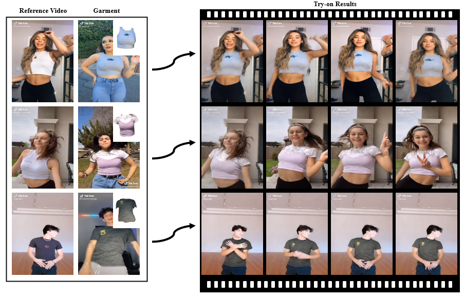
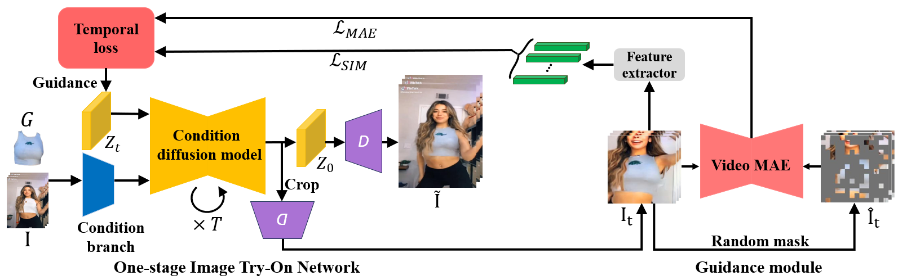

# WildVidFit Video Virtual Try-On in the Wild via Image-Based Controlled Diffusion Model



## Method piepeline ##


## Requirements
diffusers==0.17.0

## DataSet and pre-process
#### VITON-HD

1. Download the [VITON-HD](https://github.com/shadow2496/VITON-HD) dataset
2. Clothes feature extraction, use `extract_dino_fea.py` 

Once the dataset is downloaded, the folder structure should look like this:

```
├── VITON-HD
|   ├── test_pairs.txt
|   ├── train_pairs.txt
│   ├── [train | test]
|   |   ├── image
│   │   │   ├── [000006_00.jpg | 000008_00.jpg | ...]
│   │   ├── cloth
│   │   │   ├── [000006_00.jpg | 000008_00.jpg | ...]
│   │   ├── cloth-mask
│   │   │   ├── [000006_00.jpg | 000008_00.jpg | ...]
│   │   ├── image-parse-v3
│   │   │   ├── [000006_00.png | 000008_00.png | ...]
│   │   ├── openpose_img
│   │   │   ├── [000006_00_rendered.png | 000008_00_rendered.png | ...]
│   │   ├── openpose_json
│   │   │   ├── [000006_00_keypoints.json | 000008_00_keypoints.json | ...]
│   │   ├── dino_fea
│   │   │   ├── [000006_00.pt  | 000008_00.pt  | ...]
```
#### DressCode
1. Download the [DressCode](https://github.com/aimagelab/dress-code) dataset
2. To enhance the performance of our warping module, we have discovered that using in-shop images with a white
   background
   yields better results. To facilitate this process, we now offer pre-extracted masks that can be used to remove the
   background from the images. You can download the masks from the following
   link: [here](https://github.com/miccunifi/ladi-vton/releases/download/weights/dresscode_masks.zip). Once downloaded,
   please
   extract the mask files and place them in the dataset folder alongside the corresponding images.
3. Clothes featue extraction, use `extract_dino_fea.py` 
Once the dataset is downloaded, the folder structure should look like this:

```
├── DressCode
|   ├── test_pairs_paired.txt
|   ├── test_pairs_unpaired.txt
|   ├── train_pairs.txt
│   ├── [dresses | lower_body | upper_body]
|   |   ├── test_pairs_paired.txt
|   |   ├── test_pairs_unpaired.txt
|   |   ├── train_pairs.txt
│   │   ├── images
│   │   │   ├── [013563_0.jpg | 013563_1.jpg | 013564_0.jpg | 013564_1.jpg | ...]
│   │   ├── masks
│   │   │   ├── [013563_1.png| 013564_1.png | ...]
│   │   ├── keypoints
│   │   │   ├── [013563_2.json | 013564_2.json | ...]
│   │   ├── label_maps
│   │   │   ├── [013563_4.png | 013564_4.png | ...]
│   │   ├── skeletons
│   │   │   ├── [013563_5.jpg | 013564_5.jpg | ...]
│   │   ├── dense
│   │   │   ├── [013563_5.png | 013563_5_uv.npz | 013564_5.png | 013564_5_uv.npz | ...]
│   │   ├── dino_fea
│   │   │   ├── [013563_1.pt  | 013564_1.pt  | ...]
```

#### VVT Dataset
1. Download the VVT Dataset (ask the author)
2. Pose estimation
3. Feature extraction, use `extract_dino_fea_vtt.py` 
```
├── VVT
|   ├── test_pairs.txt
|   ├── train_pairs.txt
|   ├── clothes_person
│   │   ├── dino_fea
│   │   ├── img
|   ├── train_frames
│   │   │   ├── [4be21d0a1-n11 | 4be21d09i-k11 | ...]
|   ├── train_frames_parsing
│   │   │   ├── [4be21d0a1-n11 | 4be21d09i-k11 | ...]
|   ├── train_openpose_img
│   │   │   ├── [4be21d0a1-n11 | 4be21d09i-k11 | ...]
|   ├── train_openpose_json
│   │   │   ├── [4be21d0a1-n11 | 4be21d09i-k11 | ...]
|   ├── test_frames
│   │   │   ├── [4he21d00f-g11 | 4he21d00f-k11 | ...]
|   ├── test_frames_parsing
│   │   │   ├── [4he21d00f-g11 | 4he21d00f-k11 | ...]
|   ├── test_openpose_img
│   │   │   ├── [4he21d00f-g11 | 4he21d00f-k11 | ...]
|   ├── test_openpose_json
│   │   │   ├── [4he21d00f-g11 | 4he21d00f-k11 | ...]
```
#### TikTok Dataset
1. Download the [TikTok Dataset](https://www.yasamin.page/hdnet_tiktok#h.jr9ifesshn7v)
2. Pre-process
    1. openpose for pose estimation
    2. parsing by [SCHPA](https://github.com/hrushikesh26/Self-Correction-Human-Parsing-for-ACGPN)
    3. feature extraction, use `extract_dino_fea.py` 
```
├── TikTok
|   ├── test_pairs.txt
|   ├── train_pairs.txt
|   ├── cloth
│   │   ├── [00008.png | 00009.png | ...]
│   ├── dino_fea
│   │   ├── [00008.pt  | 00009.pt  | ...]
|   ├── openpose_img
│   │   │   ├── [00001 | 00002 | ...]
|   ├── openpose_json
│   │   │   ├── [00001 | 00002 | ...]
|   ├── parse
│   │   │   ├── [00001 | 00002 | ...]
|   ├── parse_lip
│   │   │   ├── [00001 | 00002 | ...]
|   ├── TikTok_dataset
│   │   │   ├── [00001 | 00002 | ...]
```
## Pretrain model preparation ##
1. Download [Stable Diffusion 1.5](https://huggingface.co/runwayml/stable-diffusion-v1-5)
2. Download [mae pretrain model](https://dl.fbaipublicfiles.com/video-mae-100x4-joint.pth)

## Trained model ##
**unet** 
* agnostic_norm_hair_have_background: VITON, DressCode, Wild Video使用, 但是这个模型在down fuse存在一个bug 
* agnostic_nonorm_hair_have_background_black nonorm: nonorm, 有背景和头发，但是agnostic的cloth用黑色mask 
* agnostic_nonorm_hair_have_background_gray nonorm: nonorm, 有背景和头发，但是agnostic的cloth用常规的灰色mask 
* model_VITON_512_fixbug: 上面的模型将这个bug修复后 
* model_VTT_192_256_1030_fixbug： VTT 
* model_VTT_192_256_1030_fixbug_long: VTT 
* model_TikTok_512_fixbug_1107:   TikTok 
* model_TikTok_512_fixbug_1109_atr: TikTTok, parse use atr 
* model_TikTok_512_fixbug_1109_lip:: TikTok, parse use lip 

**vae**
* HR_VITON_vae： 通用的用emasc ft后的vae
* model_VTT_vae: VVT数据集的vae

## Training ##
Train the network for VITON, DressCode

```accelerate launch --mixed_precision="fp16"  anydoor_train.py ```

Train the network for TikTok (only dataset different)

```accelerate launch --mixed_precision="fp16"  anydoor_train_TikTok.py```

Train vae
Train the vae using emasc in LaDI-VTON

```train_cloth_vae_agnostic.py``` 

```train_cloth_vae_agnostic_TikTok.py```  

## Inference ##
### image-level ###
revise the dataset, model in ```config.py```, then

```python infer.py```

### video-level ###

ps: 注意dataset调整起始位置
```python infer_video.py```: base video infer. TikTok, VVT, Wild video can use

ps: 注意VTTDataset的set_group 用于设定源数据是哪个
```python infer_video_vtt_list```: for VVT, multiple cases prediction

```python infer_video_mae_guided.py```: add mae guiding

```python infer_video_guided.py```: add clip guiding based on this [clip guiding example](https://github.com/huggingface/diffusers/blob/main/examples/community/clip_guided_images_mixing_stable_diffusion.py)

```python infer_video_mae_clip_guided.py```: mae and similarity guidace

## Evaluate ##
Fid and Kid for image try-on network. Note that we should resize the GT into the size match with the prediction

```fidelity --input1 VITON_test_unpaired --input2 /data1/hzj/zalando-hd-resized/test/image_512/ -g 1 -f -k```

## Other Note ##
anydoor_train时 读自己得模型不需要删除conv
wild_config.py WildVideoDataset.py 用wild视频直接换衣
pipeline 应该用pcm而不是paser_upper_mask, pcm归0区域更小


## Demo ##
 
